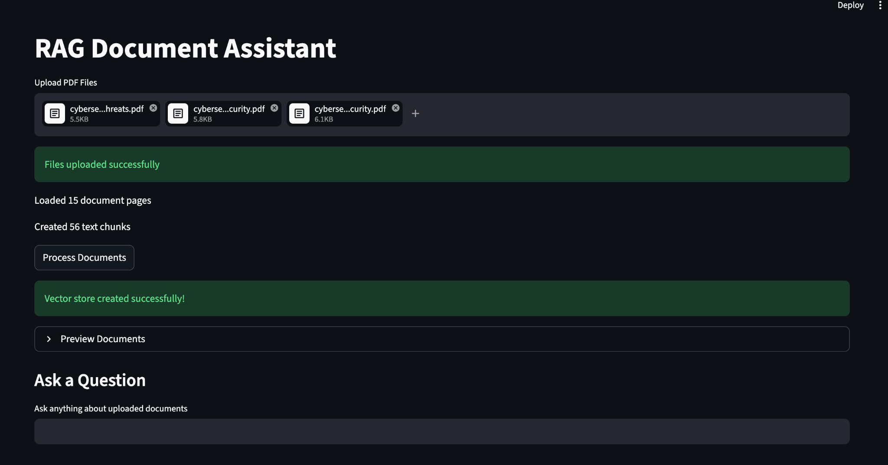
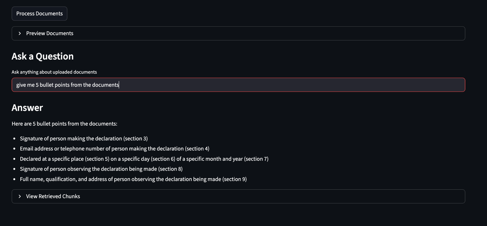

# 📚 RAG Document Assistant

A production-style Retrieval-Augmented Generation (RAG) application built with Streamlit, LangChain, Qdrant, and Groq.

Users can upload PDF documents, create embeddings, store them in a vector database, and ask questions grounded in the uploaded documents.

---

## 🚀 Features

- Upload PDF documents
- Extract and process document text
- Intelligent document chunking
- Semantic search using embeddings
- Vector storage with Qdrant
- Retrieval of relevant document chunks
- AI-powered question answering using Groq LLMs
- Source chunk inspection
- Modular production-style architecture

---

## 📸 Application Screenshots

### Document Upload & Processing

Users can upload multiple PDF documents, preview extracted content, create text chunks, and build a vector store for semantic retrieval.



---

### Question Answering & Retrieval

Users can ask questions about uploaded documents and receive AI-generated answers grounded in the retrieved document context.



---

## 🏗️ Project Architecture

```text
User Question
      │
      ▼
Retriever
      │
      ▼
Relevant Chunks
      │
      ▼
Prompt Template
      │
      ▼
Groq LLM
      │
      ▼
Generated Answer
```

---

## 📂 Project Structure

```text
rag-document-assistant/
│
├── app.py
│
├── src/
│   ├── config.py
│   ├── document_loader.py
│   ├── text_splitter.py
│   ├── vector_store.py
│   ├── retriever.py
│   ├── rag_chain.py
│   └── prompts.py
│
├── data/
│   ├── uploads/
│   └── qdrant_db/
│
├── images/
│   ├── upload-and-processing.png
│   └── question-answering.png
│
├── requirements.txt
├── .env.example
├── .gitignore
└── README.md
```

---

## 🛠️ Tech Stack

- Python 3.11
- Streamlit
- LangChain
- Qdrant
- Groq
- HuggingFace Embeddings
- PyPDF

---

## ⚙️ Installation

Clone the repository:

```bash
git clone https://github.com/yourusername/rag-document-assistant.git
cd rag-document-assistant
```

Create a virtual environment:

```bash
python3.11 -m venv venv
source venv/bin/activate
```

Install dependencies:

```bash
pip install -r requirements.txt
```

---

## 🔑 Environment Variables

Create a `.env` file:

```env
GROQ_API_KEY=your_groq_api_key
```

Get a free API key from:

https://console.groq.com/keys

---

## ▶️ Running the Application

```bash
streamlit run app.py
```

The application will open in your browser automatically.

---

## 🧠 How RAG Works

### 1. Document Loading

PDF documents are uploaded and converted into LangChain Documents.

### 2. Chunking

Large documents are split into smaller overlapping chunks to improve retrieval quality.

### 3. Embeddings

Each chunk is transformed into a vector representation using HuggingFace embeddings.

### 4. Vector Storage

Embeddings are stored in a local Qdrant vector database.

### 5. Retrieval

When a user asks a question, the system retrieves the most relevant chunks based on semantic similarity.

### 6. Generation

The retrieved context is sent to a Groq-hosted LLM, which generates an answer grounded in the uploaded documents.

---

## 📖 Example Questions

- What is the leave policy?
- Summarize this document.
- What are the key responsibilities mentioned?
- What deadlines are specified?
- What recommendations does the report provide?

---

## 🎯 Learning Objectives

This project demonstrates:

- Retrieval-Augmented Generation (RAG)
- Semantic Search
- Embeddings
- Vector Databases
- Prompt Engineering
- LangChain Pipelines
- Production-Ready Project Structure

---

## 🔮 Future Improvements

- Chat history memory
- Multi-document collections
- Source citations
- Hybrid search
- Reranking
- Streaming responses
- Evaluation metrics
- Docker deployment
- Authentication

---

## 📜 License

This project is for educational and portfolio purposes.